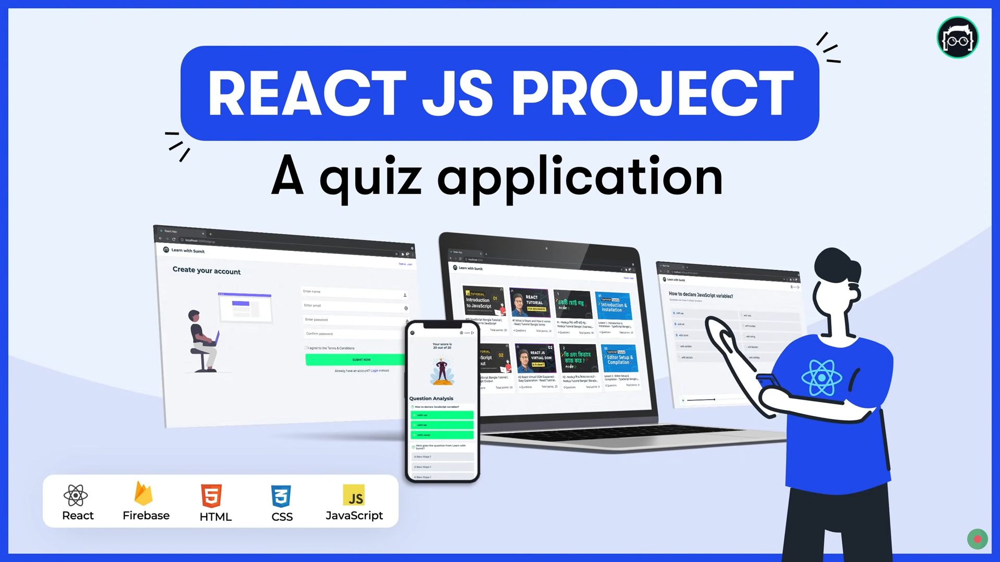

## Quiz Application

This project is a quiz application built using React and Firebase. It is a single page application that allows users to take a quiz, play related videos and view their score at the end of the quiz.

    

## Live Link

GitHub: https://github.com/tanviranindo/quiz-application

Vercel: https://quiz-application-tanviranindo.vercel.app

## Tools

 

## Features

- Users will have authentication system (login and register)

- Users can take quiz and view total marks and number of questions

- Users can view related video while taking quiz

- Users can view their score and analysis at the end of the quiz

## References

### React Quiz - Learn with Sumit

GitHub Repository - https://github.com/learnwithsumit/react-quiz

YouTube Link - https://lwsbd.link/rquiz

### Think in a React way - Learn with Sumit

YouTube Playlist - https://www.youtube.com/playlist?list=PLHiZ4m8vCp9M6HVQv7a36cp8LKzyHIePr

GitHub Repository - https://github.com/learnwithsumit/think-in-a-react-way
